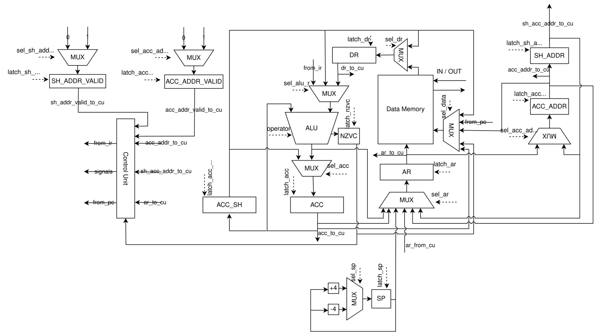
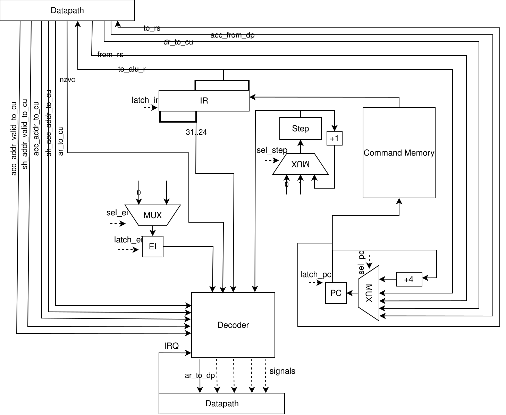

# Лабораторная работа №4. Эксперимент: транслятор и модель процессора

**Автор:** Бойко Георгий Александрович, P3216.  
**Дисциплина:** Архитектура компьютера.

## Вариант

```
forth | acc | harv | hw | tick | binary | trap | mem | cstr | prob1 | superscalar
```

| Параметр       | Значение                                                                 |
|----------------|--------------------------------------------------------------------------|
| `forth`        | Исходный язык — Forth-подобный (стек-ориентированный)                    |
| `acc`          | Аккумуляторная архитектура                                               |
| `harv`         | Гарвардская: память команд и память данных раздельны                     |
| `hw`           | Hardwired Control Unit                                                   |
| `tick`         | Tick-accurate моделирование (точность — такт)                            |
| `binary`       | Бинарное представление машинного кода (см. также `.hex`-листинг)         |
| `trap`         | Ввод-вывод через прерывания (trap-based IO)                              |
| `mem`          | Memory-mapped IO (адреса 3 = INPUT, 4 = OUTPUT)                          |
| `cstr`         | C-строки (нуль-терминированные) в памяти данных                          |
| `prob1`        | Project Euler #4 (наибольшее произведение-палиндром)          |
| `superscalar`  | Усложнение: 2× суперскалярность через AC_SHADOW                          |

## Содержание

1. [Язык программирования](#язык-программирования)
2. [Организация памяти](#организация-памяти)
3. [Система команд (ISA)](#система-команд-isa)
4. [Транслятор](#транслятор)
5. [Модель процессора](#модель-процессора)
6. [Суперскалярность (AC_SHADOW)](#суперскалярность-ac_shadow)
7. [Прерывания и I/O](#прерывания-и-io)
8. [Архитектура процессора](#архитектура-процессора)
9. [Тесты](#тесты)
10. [Запуск](#запуск)

---

## Язык программирования

Реализован Forth-подобный язык с обратной польской записью. Все
вычисления идут через стек данных, вызовы подпрограмм управляются
стеком возвратов. Подробности об их физической организации — в
разделе «Система команд» ниже.

### BNF

```ebnf
<program> ::= { <variable> | <definition> | <command> }

<variable> ::= "variable" <name>

<definition> ::= <function_definition> | <isr_definition>

<function_definition> ::= ":" <name> [ "recursive" ] <definition_body> ";"
<isr_definition> ::= ":isr" <name> <definition_body> ";"

<definition_body> ::= { <command> }

<command> ::= <control_flow> | <word>

<word> ::=  <reserved_word> | <user_word> | <number> | <string> | <commentary>

<reserved_word> ::= <stack_operation> | <number_operation> | <compare_operator> | <logical_operator> | <io_operation> | <memory_operation> | <execution_token_operation>

<user_word> ::= <name>

<number> ::= [ "-" ] <digit> { <digit> }

<string> ::= "\"" { <any character exclude quote> } "\""

<control_flow> ::= <condition> | <loop>

<condition> ::= "if" <condition_body> [ "else" <condition_body> ] "endif"

<loop> ::= "begin" <loop_body> "until"
<loop_body> ::= { <command> }

<commentary> ::= "(" { <any character except ")" > } ")" | "\" { <any character except "\n"> } "\n"

<condition_body> ::= { <command> }

<stack_operation> ::= "rot" | "over" | "dup" | "drop" | "swap"
<number_operation> ::= "+" | "-" | "*" | "/" | "mod" | "/mod"
<compare_operator> ::= "=" | "<" | ">"
<logical_operator> ::= "and" | "or" | "xor" | "not"
<io_operation> ::= "key" | "emit"
<memory_operation> ::= "@" | "!"
<execution_token_operation> ::= "'" | "execute"

<name> ::= <letter> { <letter> | <digit> | "_" }

<letter> ::= "a" | "b" | "c" | ... | "z" | "A" | "B" | "C" | ... | "Z"
<digit> ::= "0" | "1" | "2" | ... | "9"
```

### Семантика ключевых слов

| Слово       | Стек до → после            | Описание                                    |
|-------------|----------------------------|---------------------------------------------|
| `dup`       | `( a -- a a )`             | Дублировать вершину                          |
| `drop`      | `( a -- )`                 | Снять вершину                                |
| `swap`      | `( a b -- b a )`           | Поменять местами две верхние                 |
| `over`      | `( a b -- a b a )`         | Скопировать предпоследнее на вершину         |
| `rot`       | `( a b c -- b c a )`       | Третье снизу на вершину                      |
| `+ - * / mod` | `( a b -- (a op b) )`    | Арифметика                                   |
| `= < >`     | `( a b -- flag )`          | Сравнение (0/1)                              |
| `and or xor not` | `( a b -- r )` / `( a -- r )` | Побитовая логика                       |
| `@`         | `( addr -- val )`          | Прочитать ячейку памяти                      |
| `!`         | `( val addr -- )`          | Записать в ячейку памяти                     |
| `key`       | `( -- ch )`                | Прочитать `mem[INPUT_ADDR]`                  |
| `emit`      | `( ch -- )`                | Записать `mem[OUTPUT_ADDR]`                  |
| `'` *word*  | `( -- xt )`                | Положить execution token (адрес функции)     |
| `execute`   | `( xt -- )`                | Вызвать функцию по адресу с вершины          |
| `variable n` | —                         | Резервирует ячейку, делает `n` адресной константой |
| `: f … ;`   | —                         | Определение слова `f`                        |
| `:isr h … ;`| —                         | Определение обработчика прерывания (ISR)     |
| `if … else … endif` | `( flag -- )`      | Условие (0 = false, иначе true)              |
| `begin … until`     | `( -- ) … ( flag -- )` | Цикл с пост-условием                  |

### Семантика языка

- **Стратегия вычислений** — последовательная, все операнды
  вычисляются до применения слова; ленивых конструкций нет.
- **Области видимости** — все переменные являются глобальными и при компиляции размещаются в памяти данных
- **Типизация** — динамическая, бестиповая на уровне ЯП: на стеке
  лежат 32-битные знаковые целые. Любая интерпретация (число / адрес /
  код символа / флаг) определяется тем словом, которое работает со
  значением. Runtime-проверок типов нет.

### «Массивов» как типа нет

Массив — это просто непрерывный участок памяти данных, адресуемый арифметически:

```forth
: arr 1500 ;          \ база массива
arr i @ + @           \ читаем arr[i]:  mem[1500 + i]
arr i @ + value !     \ пишем arr[i]:   mem[1500 + i] = value
```

### Строки (C-style)

Строковые литералы `"…"` укладываются в статическую память данных как нуль-терминированные (C-строки). Первый байт строки даётся на стек как её адрес, дальнейший вывод — посимвольный через `emit`.

### Размещение объектов программы (литералы / константы / переменные / процедуры / прерывания)

| Объект | Куда попадает | Когда / как | Адресация |
|--------|---------------|-------------|-----------|
| Числовой литерал `42` | внутрь инструкции `LOAD_IMM 42` | в момент трансляции слова | непосредственная |
| Строковый литерал `"abc"` | статическая секция памяти данных | по мере появления в исходнике, по одной 32-битной ячейке на символ + `\0` | прямая по адресу базы, далее «+1 индекс слова» |
| Переменная `variable n` | статическая секция памяти данных, 1 ячейка | при объявлении | прямая (адрес зашит в инструкциях как константа) |
| Слово `: f … ;` | память команд, по `PC` после предыдущего кода | при первом появлении определения | вызов через `CALL <addr>` или через `' f` (execution token, по тому же `<addr>`) |
| Обработчик `:isr h … ;` | память команд, как обычная процедура; адрес дополнительно записывается в IVT (`mem[0]`) | при объявлении `:isr` | косвенная через IVT, переход выполняется аппаратно в начале такта |

Переменных в регистрах нет — аккумуляторная архитектура с одним
`ACC`. Всё остальное в любой момент находится либо в статической части памяти данных, либо на стеке данных, либо на стеке возвратов — про устройство обоих стеков см. раздел «Система команд».

---

## Организация памяти

Архитектура **Гарвардская** — память команд и память данных раздельны.

### Память данных

```
Адрес    Содержимое                                         Назначение
─────    ──────────────────────────────────────────         ─────────────────────────
   0     IVT[0]                                             Адрес ISR ввода
   1     TEMP0                                              Временный регистр
   2     TEMP1                                              Временный регистр
   3     TEMP2                                              Временный регистр
   4     INPUT                                              MMIO: ввод
   5     OUTPUT                                             MMIO: вывод
   6     DATA_SP                                            Указатель вершины стека данных
   7     ACC_SAVE                                           Сохранённый ACC при IRQ
   8     ACC_ADDR_SAVE                                      Сохранённый ACC_ADDR при IRQ
   9     NZVC_SAVE                                          Сохранённые флаги NZVC при IRQ
  10..12 TEMP0_SAVE..TEMP2_SAVE                             Сохраненные временные регистры
  13..M  user vars + static strings                         Переменные и литералы строк
   …
   8191 ← INITIAL_SP                                        SP-старт (аппаратный стек CALL/RET)
```

Стек данных и аппаратный стек возвратов растут вниз.
Указатель вершины стека данных хранится в ячейке `DATA_SP` и
инициализируется значением `DATA_MEMORY_SIZE / 2 - 1 = 4095`; аппаратный
SP (`INITIAL_SP = 8191`) используется для `CALL`/`RET`/`IRET`.

#### Адресация и выравнивание

В рамках эксперимента в процессоре реализовано
**постоянное выравнивание всех значений в памяти данных по границе
машинного слова (4 байта / 32 бита)**.  Выравнивание выполняется на
этапе трансляции: codegen размещает каждую переменную и каждый символ
C-строки в отдельной 32-битной ячейке, поэтому соседние логические
объекты разделены ровно одним «адресом» в текущей нумерации.

Внутри `DataPath` память данных хранится как массив 32-битных слов и
индексируется напрямую: один адрес — одно слово.  По сути это значит,
что байтовый адрес жёстко равен `word_index * 4`, а младшие 2 бита
адреса всегда нулевые — невыровненный доступ ISA-инструкциями
невозможен, потому что транслятор никогда такого адреса не порождает.
Снаружи (в исходниках на Forth) видны «логические» индексы слов:
например, `1 +` для перехода к следующей ячейке буфера.
Адрес в инструкции — это байтовый адрес с обрезанными младшими 2 битами,
что эквивалентно индексу слова.

### Память команд

Память команд байт-адресуема: PC хранит **байтовый** адрес, инкремент
PC между инструкциями равен `INSTR_BYTES = 4`.  Чтение слова инструкции
по байтовому адресу склеивает 4 последовательных байта (big-endian).

---

## Система команд (ISA)

### Кодирование

| Тип инструкции    | Размер | Формат                                   |
|-------------------|--------|------------------------------------------|
| Все инструкции    | 4 байт | `[opcode] [b2] [b1] [b0]` (Big-Endian, signed) |

Все инструкции имеют фиксированный размер 32 бита:
  - Биты 31..24 - опкод (8 бит)
  - Биты 23..0  - знаковый аргумент (24 бита)

Все адреса меток / `CALL` / `JUMP` — **байтовые**, вычисляются линкером.

### Список опкодов

| Группа        | Опкоды                                                                 | Аргумент?       |
|---------------|------------------------------------------------------------------------|-----------------|
| Управление    | `HALT`, `JUMP`, `CALL`, `CALL_ACC`, `RET`, `IRET`                      | JUMP/CALL — да |
| Ветвления     | `BEQZ`, `BNEZ`, `BGTZ`, `BLTZ`, `BGEZ`, `BLEZ`, `BVS`, `BVC`, `BCS`, `BCC` | да           |
| Загрузка ACC  | `LOAD addr`, `LOAD_IMM imm`, `LOAD_ACC`                                | LOAD/LOAD_IMM — да |
| Запись ACC    | `STORE addr`, `STORE_IND addr`                                         | STORE/STORE_IND — да |
| Сдвиги        | `SHIFTL`, `SHIFTR`                                                     | нет             |
| Арифметика    | `ADD addr`, `ADD_IMM imm`, `SUB addr`, `SUB_IMM imm`, `MUL addr`, `DIV addr`, `MOD addr`, `INC`, `DEC` | ADD/SUB/MUL/DIV/MOD — да |
| Логика        | `AND addr`, `OR addr`, `XOR addr`, `NOT`                               | AND/OR/XOR — да |
| Флаги         | `CLC`, `CLV`                                                           | нет             |

Отдельных стековых инструкций в ISA нет — обе стековые структуры
полностью эмулируются через приведённые выше команды (см. ниже).

### Стеки и их указатели

В системе есть **два независимых стека**, оба растут вниз по памяти данных:

1. **Стек данных (data stack)** — эмулируется полностью в памяти.
   Его вершина адресуется через ячейку памяти `DATA_SP` по адресу
   `mem[6]`; начальное значение — `DATA_MEMORY_SIZE / 2 - 1 = 4095`.
   Все push/pop порождаются транслятором как последовательности
   обычных инструкций над этой ячейкой.

2. **Стек возвратов (return stack)** — лежит в памяти данных,
   его указатель — аппаратный регистр `SP` в DataPath,
   инициализируемый значением `INITIAL_SP = DATA_MEMORY_SIZE - 1 = 8191`.
   Используется неявно инструкциями `CALL`, `RET`, `IRET`,
   а также при сохранении/восстановлении PC во время прерывания.
   Программисту прямой инструкции для работы с ним не дано — это
   зона ответственности Control Unit.


### Семантика основных инструкций

* `LOAD addr` — `ACC ← mem[addr]`
* `LOAD_IMM imm` — `ACC ← imm` (знаковое 24-битное расширение до 32 бит)
* `LOAD_ACC` — `ACC ← mem[ACC]` (косвенная по `ACC`)
* `STORE addr` — `mem[addr] ← ACC`
* `STORE_IND addr` — `mem[mem[addr]] ← ACC` (косвенная по указателю)
* `ADD addr` — `ACC ← ACC + mem[addr]`, обновляет NZVC
* `ADD_IMM imm / SUB_IMM imm` — операнд берётся из аргумента инструкции (без обращения к памяти)
* `INC / DEC` — `ACC ± 1`
* `SHIFTL / SHIFTR` — сдвиги `ACC` на 1 бит
* `CALL addr` — `mem[SP] ← PC_next; SP ← SP - 4; PC ← addr`
* `CALL_ACC` — то же, но `PC ← ACC` (используется для `execute` / execution token)
* `RET` — `SP ← SP + 4; PC ← mem[SP]`
* `IRET` — `RET` + восстановление `ACC` из `mem[ACC_SAVE_ADDR]`, флагов из `mem[NZVC_SAVE_ADDR]` и `IE ← 1`

### Флаги АЛУ

| Флаг | Значение                          |
|------|-----------------------------------|
| Z    | Zero                              |
| N    | Negative                          |
| V    | Overflow                          |
| C    | Carry                             |

### Время выполнения инструкций (в тактах)

Все инструкции занимают **1 такт на FETCH + N тактов на EXECUTE**.
Колонка «Baseline» (`--no-superscalar`) — всегда детерминированна.
Колонка «Superscalar» имеет диапазон: лучший случай — когда
сработала отложенная запись / forward из `AC_SHADOW`; худший —
когда пришлось делать parallel-flush.

| Инструкция            | Baseline    | Superscalar (best — worst)        |
|-----------------------|-------------|------------------------------------|
| `HALT`                | 1           | 1 — 3 (если предшествующий flush)  |
| `LOAD_IMM imm`        | 1 + 1 = 2   | 2                                  |
| `ADD_IMM / SUB_IMM`   | 1 + 1 = 2   | 2                                  |
| `INC / DEC / NOT`     | 1 + 1 = 2   | 2                                  |
| `SHIFTL / SHIFTR`     | 1 + 1 = 2   | 2                                  |
| `CLC / CLV`           | 1 + 1 = 2   | 2                                  |
| `LOAD addr`           | 1 + 3 = 4   | 1 + 1 = 2 (shadow-fwd / dead-load) — 1 + 3 = 4 (miss) |
| `LOAD_ACC`            | 1 + 3 = 4   | 2 — 4                              |
| `STORE addr`          | 1 + 2 = 3   | 1 + 1 = 2 (deferred / overwrite) — 1 + 2 = 3 (parallel-flush) |
| `STORE_IND addr`      | 1 + 4 = 5   | 1 + 3 = 4 — 1 + 4 = 5              |
| `ADD/SUB/MUL/DIV/MOD addr` | 1 + 3 = 4 | 1 + 1 = 2 (shadow-fwd) — 1 + 3 = 4 |
| `AND / OR / XOR addr` | 1 + 3 = 4   | 2 — 4                              |
| `JUMP addr` / `BEQZ…BCC` | 1 + 1 = 2 | 2                                  |
| `CALL addr` / `CALL_ACC` | 1 + 2 = 3 | 1 + 2 = 3 — 1 + 4 = 5 (с flush AC_SHADOW) |
| `RET`                 | 1 + 4 = 5   | 1 + 4 = 5 — 1 + 6 = 7              |
| `IRET`                | 1 + 12 = 13 | 1 + 12 = 13 (flush уже встроен в шаги 1–2) |

Прерывание дополнительно добавляет **12 тактов** на пролог
(`_isr_entry_tick`, шаги 0–11 — flush shadow + сохранение ACC /
ACC_ADDR / NZVC + чтение IVT и переход на ISR), плюс полный цикл
`IRET` на выходе.

Из таблицы видно, почему теневой аккумулятор даёт измеримое, но
не радикальное ускорение: выгода в основном на парах `STORE addr / LOAD addr`, тогда как управляющие инструкции (`CALL`,
`RET`, `IRET`, ветвления) и арифметика над аккумулятором по
тактам не меняются.

## Транслятор

`translator.py` → `Lexer` → `Parser` → `CodeGenerator`.

### Интерфейс командной строки

```bash
python3 translator.py <source.forth> <code.bin> <memory.bin>
```

- *Входные данные* (позиционные аргументы):
  1. `<source.forth>` — имя входного файла с исходным кодом на Forth-подобном языке (текст, UTF-8).
  2. `<code.bin>` — имя выходного файла, в который будет записан бинарный машинный код.
  3. `<memory.bin>` — имя выходного файла со статической памятью данных (литералы строк, начальные значения переменных).
- *Выходные данные*:
  - `<code.bin>` — бинарный машинный код, по 4 байта на инструкцию, big-endian.
  - `<code.bin.hex>` — отладочный текстовый листинг вида
    `<address> - <HEXCODE> - <mnemonic>`, человекочитаемый.
  - `<memory.bin>` — бинарный образ статической памяти данных.
  - `<memory.bin.hex>` — текстовый листинг памяти данных.
  - В `stdout` печатается одна строка вида
    `source LoC: <N> code instr: <M>`.

### Pipeline

```
*.forth ─► parse_tokens (lex)
       ─► Parser.parse() (AST: WordNode/IfNode/LoopNode/FuncDefNode/TickNode/…)
       ─► CodeGenerator.generate() ─► список dict-инструкций
       ─► resolve_labels() ─► байтовые адреса
       ─► isa.to_bytes() ─► бинарь .bin
       ─► isa.to_hex() ─► читаемый листинг .bin.hex
       + аналогично для статической памяти данных (.mem.bin / .mem.bin.hex)
```

---

## Модель процессора

### Интерфейс командной строки

```bash
python3 machine.py <code.bin> <memory.bin> <input.json> [--debug] [--no-superscalar]
```

- *Входные данные*:
  1. `<code.bin>` — бинарный машинный код от транслятора.
  2. `<memory.bin>` — бинарный образ статической памяти данных.
  3. `<input.json>` — JSON-расписание прерываний ввода вида
     `[[tick, char_code], …]` (формат `trap`-варианта).
  4. `--debug` — печатать tick-accurate журнал работы процессора в `stderr`.
  5. `--no-superscalar` — отключить теневой аккумулятор и работать в
     базовом режиме (для сравнения по производительности).
- *Выходные данные*:
  - `stdout` — вывод, накопленный через `emit` (MMIO OUTPUT) и
    декодированный как ASCII.
  - `stderr` — журнал моделирования: состояния регистров, мнемоники
    выполняемых инструкций, текущее значение стека данных и
    сводная статистика (`output: [...]`, `ticks: N`).


### Пошаговое выполнение инструкций (Step-based execution)

Процессор моделируется с точностью до такта. Используется пошаговая модель выполнения инструкций, где каждая инструкция выполняется за переменное количество тактов (управляется регистром step), в зависимости от сложности операции.

Каждая инструкция выполняется в следующих шагах:

1. **FETCH (step == 0) - 1 такт** — Чтение инструкции из памяти команд:
   - Проверка наличия прерывания (если IE == 1 и IRQ == 1)
   - Чтение 32-битного слова по адресу PC
   - Загрузка слова в регистр IR (Instruction Register)
   - Инкремент PC на размер инструкции (4 байта)

2. **EXECUTE (step > 0) - переменное количество тактов** — Выполнение инструкции:
   - Декодирование опкода и аргумента из IR
   - Выполнение операции пошагово
   - Количество шагов зависит от сложности инструкции

---

## Суперскалярность (AC_SHADOW)

Один аккумулятор → нельзя одновременно загружать и хранить.
Решение — **shadow-регистр** `AC_SHADOW`, в который параллельно «отложенно» сохраняется ACC. Три ключевых сценария:

### 1. Deferred store (отложенная запись)

`STORE addr` при пустом shadow → ACC ↔ AC_SHADOW свапаются (`signal_shadow_swap`), фактическая запись в память откладывается до момента, когда shadow понадобится для другой цели. **0 обращений к памяти за такт.**

### 2. Shadow forwarding / dead-load elimination

`LOAD addr`, если `shadow_addr == addr` → значение уже в shadow → копируем `AC_SHADOW → ACC` без чтения памяти.  
Если `acc_addr == addr` → значение уже в ACC → пропускаем чтение (dead-load elim).

### 3. Parallel flush

Когда shadow занят чужим адресом, а нужен новый `STORE` или `LOAD`: оба регистра логически сбрасываются "одновременно" (суперскалярный момент). Однако, поскольку наша память данных однопортовая, физически невозможно произвести запись из AC_SHADOW и чтение/запись нового значения за один такт.
Поэтому на первом такте происходит выставление старого адреса в AR, на втором — фактическая запись AC_SHADOW в память с параллельным защелкиванием новых значений из ACC. Это устраняет накладные расходы на выборку (fetch) отдельных команд сохранения, экономя такты процессора, но сохраняя корректность работы с однопортовой памятью.

### Корректность для MMIO

Операции с MMIO (INPUT/OUTPUT_ADDR) обходят механизм отложенной записи во избежание потери событий ввода-вывода.

---

## Прерывания и I/O

* **Trap-based**: ввод не опрашивается, а доставляется через прерывание по расписанию `[(tick, char_code), …]`, сохранённому в `input.json` теста.
* **MMIO**: `mem[3]=INPUT`, `mem[4]=OUTPUT`. Слово `key` компилируется в `LOAD INPUT_ADDR`, `emit` — в запись в `OUTPUT_ADDR`.
* **IVT**: `mem[0]` хранит байтовый адрес ISR (заполняется компилятором при наличии `:isr`).
* **Поведение CU при IRQ**:
  1. Сбрасывается AC_SHADOW (если был не пуст)
  2. В память данных сохраняется контекст процессора: ACC → `mem[ACC_SAVE_ADDR=7]`, ACC_ADDR → `mem[ACC_ADDR_SAVE_ADDR=8]`, NZVC → `mem[NZVC_SAVE_ADDR=9]`.
  3. Текущий PC пушится на стек возвратов в памяти данных через аппаратный регистр `SP`.
  4. Читается адрес обработчика из IVT (`mem[0]`).
  5. `PC ← ISR_ADDR`, `IE ← 0` (запрет вложенных прерываний).
  6. В `IRET` контекст зеркально восстанавливается (из `mem[7..9]`), делается pop из стека возвратов через `SP`, `IE ← 1`.

Прерывыания проверяются в начале каждого такта.

---

## Архитектура процессора

### DataPath



Центральный тракт ALU / ACC:

1. **Входной MUX перед ALU**
   - Управляется сигналом `sel_alu_r`
   - Источники данных:
     * `from_ir` (непосредственное значение из IR)
     * `AC_SH` (теневой регистр аккумулятора)
     * `DR` (регистр данных)
   - Выход идет в правый вход ALU

2. **ALU**
   - Левый вход: ACC (аккумулятор)
   - Правый вход: выход MUX от sel_alu_r
   - Управляющий код: `operator` от CU
   - Выход:
     * вниз в MUX записи аккумулятора
     * вправо в блок NZVC (флаги)

3. **Флаги NZVC**
   - Регистр/блок NZVC получает результат ALU
   - Захватывается по сигналу `latch_nzvc`

4. **MUX перед ACC**
   - Управляется сигналом `sel_acc`
   - Источники:
     * результат ALU
     * AC_SHADOW
   - Выход идет в ACC

5. **ACC (аккумулятор)**
   - Запись происходит по сигналу `latch_acc`
   - Выходы:
     * `acc_to_cu` — в Control Unit
     * линия в блок ACC_SH
     * шина на мультиплексор выбора адреса

6. **ACC_SH (теневой регистр аккумулятора)**
   - Получает данные от ACC
   - Запись управляется сигналом `latch_acc_sh`
   - Выход идет:
     * в правый мультиплексор ALU
     * в мультиплексор выбора данных для записи в память

7. **DR и Data Memory**
   - DR связан с памятью данных:
     * захватывает данные по сигналу `latch_dr`
     * выход идет в верхний MUX перед ALU
   - От DataMemory линия идет также в CU как `dr_to_cu`

8. **MUX справа от Data Memory**
   - Управляется сигналом `sel_data`
   - Источники:
     * `from_pc` (для записи PC в стек возвратов)
     * `ACC_SHADOW`
     * `ACC_ADDR`
     * `NZVC`
     * `ACC`
   - Выбирает источник данных для записи в память

9. **AR и адресный тракт памяти**
   - MUX перед AR управляется сигналом `sel_ar`
   - Источники адреса:
     * `ar_from_cu`
     * результат работы ALU
     * ACC
     * SP (указатель стека возвратов)
     * ACC_ADDR
     * SH_ADDR
   - AR загружается по сигналу `latch_ar`
   - Выходы:
     * `ar_to_cu` — в Control Unit
     * адресная линия в Data Memory
     * линия на мультиплексор sel_acc_addr

10. **ACC_ADDR / SH_ADDR**
    - MUX выбора адреса управляется `sel_acc_addr`
    - Источники: AR и SH_ADDR
    - ACC_ADDR захватывается по `latch_acc_addr`
    - SH_ADDR захватывается по `latch_sh_addr`
    - Выходы идут в CU как `acc_addr_to_cu` и `sh_acc_addr_to_cu`

11. **SP (указатель стека возвратов)**
    - Аппаратный указатель стека в DataPath;
      используется `CALL`/`RET`/`IRET` и при обработке IRQ.
    - MUX SP управляется `sel_sp`, источники: `+4`, `-4`.
    - Запись: `latch_sp`.

### Control Unit



#### Входы и выходы

Из CU в DataPath выходят:
- `ar_to_dp`
- `to_rs`
- `to_alu_r`
- различные управляющие сигналы

В CU входит из DataPath:
- `ar_to_cu`
- `acc_from_dp`
- `dr_to_cu`
- `from_rs`
- `nzvc`
- `acc_addr_to_cu`
- `sh_acc_addr_to_cu`

В Decoder поступают:
- `IRQ` — запрос прерывания
- `IR[31..24]` — старшие 8 бит инструкции из регистра IR
- регистр состояния `Step`
- регистр `EI` — разрешение прерываний
- `nzvc` — флаги
- `ar_to_cu`
- `acc_addr_to_cu`
- `sh_acc_addr_to_cu`

#### Главные внутренние блоки CU

1. **IR (регистр инструкции)**
   - Хранит текущую команду
   - Запись по сигналу `latch_ir`
   - Поле `31..24` идет в Decoder

2. **Decoder**
   - Центральный управляющий блок
   - Комбинирует код операции, шаг, флаги, состояние прерываний
   - Формирует управляющие сигналы для datapath
   - Формирует сигналы для переходов по состояниям

3. **EI (бит разрешения прерываний)**
   - MUX с входами 0 и 1, управление `sel_ei`
   - Запись в регистр по `latch_ei`
   - Выход идет в Decoder

4. **Step (счетчик тактов команды)**
   - MUX с входами 0 и +1, управление `sel_step`
   - Текущее значение идет в Decoder

5. **Command Memory**
   - Память команд, выход идет в IR

6. **PC (счетчик команд)**
   - Защелкивается `latch_pc`
   - Выход идет в память команд, datapath и на MUX перед PC
   - MUX перед PC управляется `sel_pc`
   - Источники: `+4`, младшие 3 байта IR, from_rs, dr_to_cu, acc_from_dp

---

## Тесты

### Golden-тесты

Тестирование реализовано с помощью `pytest-golden`.
Каждый кейс представляет собой YAML-файл в директории `golden/`:

```yaml
source: |
  \ Исходный код на Forth
input:
  - [10, 104] \ Расписание прерываний: [tick, char_code]
translator_output: |
  \ Ожидаемый вывод транслятора
machine_output: |
  \ Ожидаемый вывод симулятора (stdout)
machine_err: |
  \ Ожидаемый вывод симулятора (stderr)
log: |
  \ Ожидаемый лог работы процессора
```

### Список реализованных кейсов

| Кейс              | Файл | Описание                                                            |
|-------------------|------|---------------------------------------------------------------------|
| `hello`           | [`golden/hello.yml`](golden/hello.yml:1) | «Hello, World!» через статическую строку и `emit` |
| `cat`             | [`golden/cat.yml`](golden/cat.yml:1)     | Чтение из ввода до символа `\n`, перевывод (echo) |
| `hello_user_name` | [`golden/hello_user_name.yml`](golden/hello_user_name.yml:1) | Печать prompt, чтение имени, печать приветствия |
| `prob1`           | [`golden/prob1.yml`](golden/prob1.yml:1) | Project Euler #4: наибольшее произведение-палиндром |
| `sort`            | [`golden/sort.yml`](golden/sort.yml:1)   | Пузырьковая сортировка массива из ввода |
| `double_precision`| [`golden/double_precision.yml`](golden/double_precision.yml:1) | Сложение/вычитание двух 64-битных чисел через флаги C/V |
| `execution_token` | [`golden/execution_token.yml`](golden/execution_token.yml:1) | Демонстрация работы с execution token |

Каждый YAML хранит: исходный код, расписание ввода, ожидаемый
вывод транслятора, `stdout`/`stderr` симулятора и фрагмент журнала
(первые и последние 100 строк, если журнал длинный).

### CI

В репозитории настроен GitHub Actions workflow
([`.github/workflows`](.github/workflows)), который на каждый push и pull request
прогоняет `ruff`, `mypy` и `pytest` с golden-тестами.

### Запуск тестов

```bash
# Запуск тестов
pytest golden/

# Обновление эталонов (если изменилась логика или формат вывода)
pytest --update-goldens golden/
```

---

## Запуск

### Транслятор

```bash
python3 translator.py <source.forth> <code.bin> <memory.bin>
# Создаёт также <code.bin.hex> и <memory.bin.hex> с человекочитаемым листингом.
```

### Симулятор

```bash
python3 machine.py <code.bin> <memory.bin> <input.json> [--debug] [--no-superscalar]
```

* `--debug` — печать tick-accurate лога;
* `--no-superscalar` — отключение суперскалярности.


### Сравнение superscalar vs baseline

| Кейс | Такты (Superscalar) | Такты (Baseline) | Ускорение |
|---|---|---|---|
| `cat` | 8208 | 8710 | 5.8% |
| `double_precision` | 15994 | 16867 | 5.2% |
| `execution_token` | 339 | 346 | 2.0% |
| `hello` | 2338 | 2591 | 9.8% |
| `hello_user_name` | 7406 | 8122 | 8.8% |
| `prob1` | 11128689 | 11579499 | 3.9% |
| `sort` | 13198 | 13955 | 5.4% |