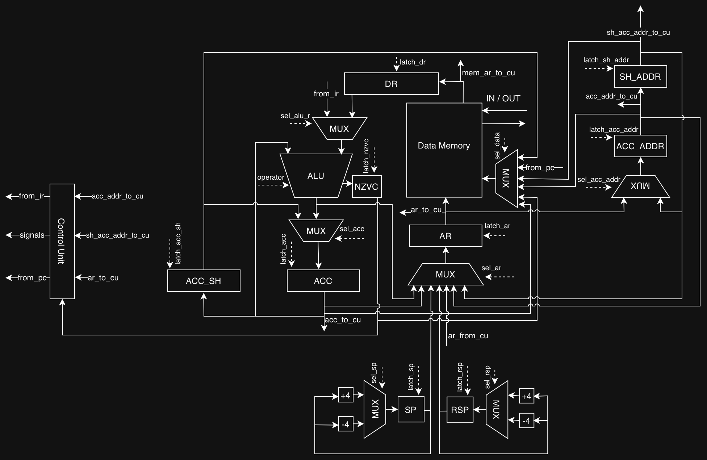
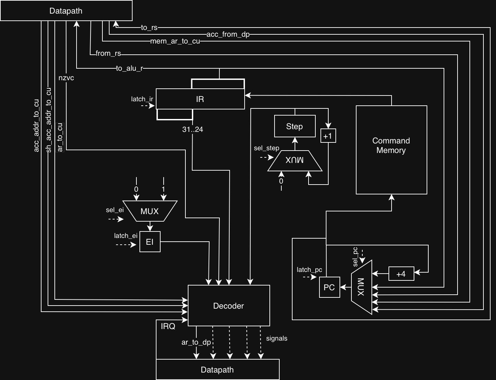

# Лабораторная работа №4. Эксперимент: транслятор и модель процессора

**Автор:** Бойко Георгий Александрович, P3216.  
**Дисциплина:** Архитектура компьютера.

## Вариант

```
forth | acc | harv | hw | tick | binary | trap | mem | cstr | prob1 | superscalar
```

| Параметр       | Значение                                                                 |
|----------------|--------------------------------------------------------------------------|
| `forth`        | Исходный язык — Forth-подобный (стек-ориентированный)                    |
| `acc`          | Аккумуляторная архитектура                                               |
| `harv`         | Гарвардская: память команд и память данных раздельны                     |
| `hw`           | Hardwired Control Unit                                                   |
| `tick`         | Tick-accurate моделирование (точность — такт)                            |
| `binary`       | Бинарное представление машинного кода (см. также `.hex`-листинг)         |
| `trap`         | Ввод-вывод через прерывания (trap-based IO)                              |
| `mem`          | Memory-mapped IO (адреса 3 = INPUT, 4 = OUTPUT)                          |
| `cstr`         | C-строки (нуль-терминированные) в памяти данных                          |
| `prob1`        | Project Euler #4 (наибольшее произведение-палиндром)          |
| `superscalar`  | Усложнение: 2× суперскалярность через AC_SHADOW                          |

## Содержание

1. [Язык программирования](#язык-программирования)
2. [Организация памяти](#организация-памяти)
3. [Система команд (ISA)](#система-команд-isa)
4. [Транслятор](#транслятор)
5. [Модель процессора](#модель-процессора)
6. [Суперскалярность (AC_SHADOW)](#суперскалярность-ac_shadow)
7. [Прерывания и I/O](#прерывания-и-io)
8. [Архитектура процессора](#архитектура-процессора)
9. [Тесты](#тесты)
10. [Запуск](#запуск)

---

## Язык программирования

Реализован Forth-подобный язык с обратной польской записью. Все вычисления идут через **стек данных** (хранится в памяти, растёт вниз от адреса `INITIAL_SP=8191`), а вызовы подпрограмм управляются **стеком возвратов** (хранится в памяти, растёт вниз от адреса `INITIAL_RSP=4095`).

### BNF

```ebnf
<program> ::= { <variable> | <definition> | <command> }

<variable> ::= "variable" <name>

<definition> ::= <function_definition> | <isr_definition>

<function_definition> ::= ":" <name> [ "recursive" ] <definition_body> ";"
<isr_definition> ::= ":isr" <name> <definition_body> ";"

<definition_body> ::= { <command> }

<command> ::= <control_flow> | <word>

<word> ::=  <reserved_word> | <user_word> | <number> | <string> | <commentary>

<reserved_word> ::= <stack_operation> | <number_operation> | <compare_operator> | <logical_operator> | <io_operation> | <memory_operation> | <execution_token_operation>

<user_word> ::= <name>

<number> ::= [ "-" ] <digit> { <digit> }

<string> ::= "\"" { <any character exclude quote> } "\""

<control_flow> ::= <condition> | <loop>

<condition> ::= "if" <condition_body> [ "else" <condition_body> ] "endif"

<loop> ::= "begin" <loop_body> "until"
<loop_body> ::= { <command> }

<commentary> ::= "(" { <any character except ")" > } ")" | "\" { <any character except "\n"> } "\n"

<condition_body> ::= { <command> }

<stack_operation> ::= "rot" | "over" | "dup" | "drop" | "swap"
<number_operation> ::= "+" | "-" | "*" | "/" | "mod" | "/mod"
<compare_operator> ::= "=" | "<" | ">"
<logical_operator> ::= "and" | "or" | "xor" | "not"
<io_operation> ::= "key" | "emit"
<memory_operation> ::= "@" | "!"
<execution_token_operation> ::= "'" | "execute"

<name> ::= <letter> { <letter> | <digit> | "_" }

<letter> ::= "a" | "b" | "c" | ... | "z" | "A" | "B" | "C" | ... | "Z"
<digit> ::= "0" | "1" | "2" | ... | "9"
```

### Семантика ключевых слов

| Слово       | Стек до → после            | Описание                                    |
|-------------|----------------------------|---------------------------------------------|
| `dup`       | `( a -- a a )`             | Дублировать вершину                          |
| `drop`      | `( a -- )`                 | Снять вершину                                |
| `swap`      | `( a b -- b a )`           | Поменять местами две верхние                 |
| `over`      | `( a b -- a b a )`         | Скопировать предпоследнее на вершину         |
| `rot`       | `( a b c -- b c a )`       | Третье снизу на вершину                      |
| `+ - * / mod` | `( a b -- (a op b) )`    | Арифметика                                   |
| `= < >`     | `( a b -- flag )`          | Сравнение (0/1)                              |
| `and or xor not` | `( a b -- r )` / `( a -- r )` | Побитовая логика                       |
| `@`         | `( addr -- val )`          | Прочитать ячейку памяти                      |
| `!`         | `( val addr -- )`          | Записать в ячейку памяти                     |
| `key`       | `( -- ch )`                | Прочитать `mem[INPUT_ADDR]`                  |
| `emit`      | `( ch -- )`                | Записать `mem[OUTPUT_ADDR]`                  |
| `'` *word*  | `( -- xt )`                | Положить execution token (адрес функции)     |
| `execute`   | `( xt -- )`                | Вызвать функцию по адресу с вершины          |
| `variable n` | —                         | Резервирует ячейку, делает `n` адресной константой |
| `: f … ;`   | —                         | Определение слова `f`                        |
| `:isr h … ;`| —                         | Определение обработчика прерывания (ISR)     |
| `if … else … endif` | `( flag -- )`      | Условие (0 = false, иначе true)              |
| `begin … until`     | `( -- ) … ( flag -- )` | Цикл с пост-условием                  |

### «Массивов» как типа нет

Массив — это просто непрерывный участок памяти данных, адресуемый арифметически:

```forth
: arr 1500 ;          \ база массива
arr i @ + @           \ читаем arr[i]:  mem[1500 + i]
arr i @ + value !     \ пишем arr[i]:   mem[1500 + i] = value
```

### Строки (C-style)

Строковые литералы `"…"` укладываются в статическую память данных как нуль-терминированные (C-строки). Первый байт строки даётся на стек как её адрес, дальнейший вывод — посимвольный через `emit`.

---

## Организация памяти

Архитектура **Гарвардская** — память команд и память данных раздельны.

### Память данных (`DATA_MEMORY_SIZE = 8192` 32-битных слов)

```
Адрес    Содержимое                                         Назначение
─────    ──────────────────────────────────────────         ─────────────────────────
   0     IVT[0]                                             Адрес ISR
   1     TEMP0                                              Временный регистр
   2     TEMP1                                              Временный регистр
   3     INPUT                                              MMIO: ввод
   4     OUTPUT                                             MMIO: вывод
   5     ACC_SAVE_ADDR                                      Сохранённый ACC при IRQ
   6     ACC_ADDR_SAVE_ADDR                                 Сохранённый ACC_ADDR при IRQ
   7     NZVC_SAVE_ADDR                                     Сохранённые флаги NZVC при IRQ
   8..M  user vars + static strings + heap                  Переменные, литералы строк
   …
   4095 ← INITIAL_RSP                                        RSP-старт (стек возвратов)
   …
   8191 ← INITIAL_SP                                        SP-старт (стек данных)
```

Процессор использует два отдельных стека:
* **Стек данных (SP)** — растет вниз от адреса 8191
* **Стек возвратов (RSP)** — растет вниз от адреса 4095 (середины памяти данных)

### Память команд

* Байтовая. PC хранит **байтовый адрес**.

---

## Система команд (ISA)

### Кодирование

| Тип инструкции    | Размер | Формат                                   |
|-------------------|--------|------------------------------------------|
| Все инструкции    | 4 байт | `[opcode] [b2] [b1] [b0]` (Big-Endian, signed) |

Все инструкции имеют фиксированный размер 32 бита:
  - Биты 31..24 - опкод (8 бит)
  - Биты 23..0  - знаковый аргумент (24 бита)

Все адреса меток / `CALL` / `JUMP` — **байтовые**, вычисляются линкером.

### Список опкодов

| Группа        | Опкоды                                                                 | Аргумент?       |
|---------------|------------------------------------------------------------------------|-----------------|
| Управление    | `HALT`, `JUMP`, `CALL`, `CALL_ACC`, `RET`, `IRET`                      | JUMP/CALL — да |
| Ветвления     | `BEQZ`, `BNEZ`, `BGTZ`, `BLTZ`, `BGEZ`, `BLEZ`, `BVS`, `BVC`, `BCS`, `BCC` | да           |
| Загрузка ACC  | `LOAD addr`, `LOAD_IMM imm`, `LOAD_ACC`, `LOAD_SP`                     | LOAD/LOAD_IMM — да |
| Запись ACC    | `STORE addr`, `STORE_IND addr`, `STORE_SP`                             | STORE/STORE_IND — да |
| Стек          | `INC_SP`, `DEC_SP`                                                     | нет             |
| Сдвиги        | `SHIFTL`, `SHIFTR`                                                     | нет             |
| Арифметика    | `ADD addr`, `SUB addr`, `MUL addr`, `DIV addr`, `MOD addr`, `INC`, `DEC` | ADD/…/MOD — да |
| Логика        | `AND`, `OR`, `XOR addr`, `NOT`                                         | AND/OR/XOR — да |
| Флаги         | `CLC`, `CLV`                                                           | нет             |

### Семантика основных инструкций

* `LOAD addr` — `ACC ← mem[addr]`
* `LOAD_IMM imm` — `ACC ← imm` (знаковый 32-битный)
* `LOAD_ACC` — `ACC ← mem[ACC]` (косвенная)
* `STORE addr` — `mem[addr] ← ACC`
* `STORE_IND addr` — `mem[mem[addr]] ← ACC` (косвенная по указателю)
* `LOAD_SP / STORE_SP` — работа с вершиной стека данных (SP-relative)
* `ADD addr` — `ACC ← ACC + mem[addr]`, обновляет NZVC
* `CALL addr` — `RS.push(PC_next); PC ← addr` (RS — аппаратный стек возвратов)
* `CALL_ACC` — то же, но `PC ← ACC`. Единственная инструкция, где PC берётся из ACC (`execute`).
* `RET` — `PC ← RS.pop()`
* `IRET` — `PC ← RS.pop(); ACC ← mem[ACC_SAVE_ADDR]; IE ← 1`

### Флаги АЛУ

| Флаг | Значение                          | Используется в           |
|------|-----------------------------------|--------------------------|
| Z    | Zero                              | BEQZ, BNEZ, BGTZ, BLEZ   |
| N    | Negative (sign)                   | BLTZ, BGEZ, BGTZ, BLEZ   |
| V    | Overflow (signed)                 | BVS, BVC                 |
| C    | Carry (unsigned)                  | BCS, BCC                 |

### Время выполнения инструкций (в тактах)

Все инструкции выполняются за переменное количество тактов:

| Инструкция          | Базовая (такты) | Суперскалярная (такты) |
|---------------------|-----------------|------------------------|
| HALT                | 1 + 0 = 1       | 1 + 0 = 1              |
| LOAD_IMM imm        | 1 + 1 = 2       | 1 + 1 = 2              |
| LOAD addr           | 1 + 3 = 4       | 1 + 1 = 2              |
| LOAD_ACC            | 1 + 3 = 4       | 1 + 1 = 2              |
| LOAD_SP             | 1 + 3 = 4       | 1 + 1 = 2              |
| STORE addr          | 1 + 2 = 3       | 1 + 1 = 2              |
| STORE_SP            | 1 + 2 = 3       | 1 + 1 = 2              |
| STORE_IND addr      | 1 + 4 = 5       | 1 + 3 = 4              |
| INC_SP              | 1 + 1 = 2       | 1 + 1 = 2              |
| DEC_SP              | 1 + 1 = 2       | 1 + 1 = 2              |
| SHIFTL              | 1 + 1 = 2       | 1 + 1 = 2              |
| SHIFTR              | 1 + 1 = 2       | 1 + 1 = 2              |
| ADD addr            | 1 + 3 = 4       | 1 + 1 = 2              |
| SUB addr            | 1 + 3 = 4       | 1 + 1 = 2              |
| MUL addr            | 1 + 3 = 4       | 1 + 1 = 2              |
| DIV addr            | 1 + 3 = 4       | 1 + 1 = 2              |
| MOD addr            | 1 + 3 = 4       | 1 + 1 = 2              |
| INC                 | 1 + 1 = 2       | 1 + 1 = 2              |
| DEC                 | 1 + 1 = 2       | 1 + 1 = 2              |
| AND addr            | 1 + 3 = 4       | 1 + 1 = 2              |
| OR addr             | 1 + 3 = 4       | 1 + 1 = 2              |
| XOR addr            | 1 + 3 = 4       | 1 + 1 = 2              |
| NOT                 | 1 + 1 = 2       | 1 + 1 = 2              |
| CLC                 | 1 + 1 = 2       | 1 + 1 = 2              |
| CLV                 | 1 + 1 = 2       | 1 + 1 = 2              |
| JUMP addr           | 1 + 1 = 2       | 1 + 1 = 2              |
| BEQZ addr           | 1 + 1 = 2       | 1 + 1 = 2              |
| BNEZ addr           | 1 + 1 = 2       | 1 + 1 = 2              |
| BGTZ addr           | 1 + 1 = 2       | 1 + 1 = 2              |
| BLTZ addr           | 1 + 1 = 2       | 1 + 1 = 2              |
| BGEZ addr           | 1 + 1 = 2       | 1 + 1 = 2              |
| BLEZ addr           | 1 + 1 = 2       | 1 + 1 = 2              |
| BVS addr            | 1 + 1 = 2       | 1 + 1 = 2              |
| BVC addr            | 1 + 1 = 2       | 1 + 1 = 2              |
| BCS addr            | 1 + 1 = 2       | 1 + 1 = 2              |
| BCC addr            | 1 + 1 = 2       | 1 + 1 = 2              |
| CALL addr           | 1 + 4 = 5       | 1 + 4 = 5              |
| CALL_ACC            | 1 + 4 = 5       | 1 + 4 = 5              |
| RET                 | 1 + 3 = 4       | 1 + 3 = 4              |
| IRET                | 1 + 11 = 12     | 1 + 11 = 12            |

## Транслятор

`translator.py` → `Lexer` → `Parser` → `CodeGenerator`.

### Pipeline

```
*.forth ─► parse_tokens (lex)
       ─► Parser.parse() (AST: WordNode/IfNode/LoopNode/FuncDefNode/TickNode/…)
       ─► CodeGenerator.generate() ─► список dict-инструкций
       ─► resolve_labels() ─► байтовые адреса
       ─► isa.to_bytes() ─► бинарь .bin
       ─► isa.to_hex() ─► читаемый листинг .bin.hex
       + аналогично для статической памяти данных (.mem.bin / .mem.bin.hex)
```

### Компиляция стек-операций

Поскольку аккумуляторная архитектура не имеет «вершины стека» как явного регистра, операции Forth-стека компилируются через data stack в памяти: `LOAD_SP` читает `mem[SP]`, `STORE_SP` пишет `mem[SP]`. 
Инкремент/декремент SP отдельными инструкциями `INC_SP`/`DEC_SP`.


### Литералы строк

`"Hello"` укладывается в статическую память (C-строка с `\0`), на стек кладётся её базовый адрес. Печать строки реализуется циклом по `@ … emit` до встречи `0`.

---

## Модель процессора

### Граница CU / DataPath

| Компонент            | Где живёт   | Обоснование |
|----------------------|-------------|-------------|
| PC                   | ControlUnit | Поток управления |
| IR                   | ControlUnit | Декодер инструкции |
| Step                 | ControlUnit | Счетчик такта внутри инструкции |
| Return Stack         | ControlUnit | Поток управления (`CALL/RET/IRET`) |
| IE, IRQ	           | ControlUnit |	Управление прерываниями |
| ACC                  | DataPath    | Данные |
| ALU + flags N,Z,V,C  | DataPath    | Данные |
| AC_SHADOW            | DataPath    | Данные (теневой аккумулятор) |
| Data Memory          | DataPath    | Данные |
| SP                   | DataPath	 | Данные (указатель стека данных) |
| RSP                  | DataPath	 | Данные (указатель стека возвратов) |
| Program Memory       | ControlUnit | Команды (Гарвард)


### Пошаговое выполнение инструкций (Step-based execution)

Процессор моделируется с точностью до такта. Используется пошаговая модель выполнения инструкций, где каждая инструкция выполняется за переменное количество тактов (управляется регистром step), в зависимости от сложности операции.

Каждая инструкция выполняется в следующих шагах:

1. **FETCH (step == 0) - 1 такт** — Чтение инструкции из памяти команд:
   - Проверка наличия прерывания (если IE == 1 и IRQ == 1)
   - Чтение 32-битного слова по адресу PC
   - Загрузка слова в регистр IR (Instruction Register)
   - Инкремент PC на размер инструкции (4 байта)

2. **EXECUTE (step > 0) - переменное количество тактов** — Выполнение инструкции:
   - Декодирование опкода и аргумента из IR
   - Выполнение операции пошагово
   - Количество шагов зависит от сложности инструкции

---

## Суперскалярность (AC_SHADOW)

Один аккумулятор → нельзя одновременно загружать и хранить.
Решение — **shadow-регистр** `AC_SHADOW`, в который параллельно «отложенно» сохраняется ACC. Три ключевых сценария:

### 1. Deferred store (отложенная запись)

`STORE addr` при пустом shadow → ACC ↔ AC_SHADOW свапаются (`signal_shadow_swap`), фактическая запись в память откладывается до момента, когда shadow понадобится для другой цели. **0 обращений к памяти за такт.**

### 2. Shadow forwarding / dead-load elimination

`LOAD addr`, если `shadow_addr == addr` → значение уже в shadow → копируем `AC_SHADOW → ACC` без чтения памяти.  
Если `acc_addr == addr` → значение уже в ACC → пропускаем чтение (dead-load elim).

### 3. Parallel flush

Когда shadow занят чужим адресом, а нужен новый `STORE` или `LOAD`: оба регистра логически сбрасываются "одновременно" (суперскалярный момент). Однако, поскольку наша память данных однопортовая, физически невозможно произвести запись из AC_SHADOW и чтение/запись нового значения за один такт.
Поэтому на первом такте происходит выставление старого адреса в AR и подготовка шины данных, на втором — фактическая запись AC_SHADOW в память с параллельным защелкиванием новых значений из ACC. Это устраняет накладные расходы на выборку (fetch) отдельных команд сохранения, экономя такты процессора, но сохраняя корректность работы с однопортовой памятью.

### Нюансы

Перед сменой потока управления (JUMP, Bxx, CALL, RET, IRET, HALT) shadow обязательно сбрасывается через `_flush_shadow`. Это гарантирует, что отложенный store произойдёт до изменения PC.

### Корректность для MMIO

Операции с MMIO (INPUT/OUTPUT_ADDR) обходят механизм отложенной записи во избежание потери событий ввода-вывода.

---

## Прерывания и I/O

* **Trap-based**: ввод не опрашивается, а доставляется через прерывание по расписанию `[(tick, char_code), …]`, сохранённому в `input.json` теста.
* **MMIO**: `mem[3]=INPUT`, `mem[4]=OUTPUT`. Слово `key` компилируется в `LOAD INPUT_ADDR`, `emit` — в запись в `OUTPUT_ADDR`.
* **IVT**: `mem[0]` хранит байтовый адрес ISR (заполняется компилятором при наличии `:isr`).
* **Поведение CU при IRQ**:
  1. Сбрасывается AC_SHADOW (если был не пуст)
  2. В память данных сохраняется контекст процессора: ACC → `mem[5]`, ACC_ADDR → `mem[6]`, NZVC → `mem[7]`
  3. Текущий PC пушится на аппаратный стек возвратов (через RSP)
  4. Читается адрес обработчика из IVT (mem[0])
  5. PC ← ISR_ADDR, IE ← 0 (запрет вложенных прерываний)
  6. В IRET контекст зеркально восстанавливается (из mem[5..7]), делается pop из RSP, IE ← 1.

Прерывыания проверяются в начале каждого такта.

---

## Архитектура процессора

### DataPath



Центральный тракт ALU / ACC:

1. **Входной MUX перед ALU**
   - Управляется сигналом `sel_alu_r`
   - Источники данных:
     * `from_ir` (непосредственное значение из IR)
     * `AC_SH` (теневой регистр аккумулятора)
     * `DR` (регистр данных)
   - Выход идет в правый вход ALU

2. **ALU**
   - Левый вход: ACC (аккумулятор)
   - Правый вход: выход MUX от sel_alu_r
   - Управляющий код: `operator` от CU
   - Выход:
     * вниз в MUX записи аккумулятора
     * вправо в блок NZVC (флаги)

3. **Флаги NZVC**
   - Регистр/блок NZVC получает результат ALU
   - Захватывается по сигналу `latch_nzvc`

4. **MUX перед ACC**
   - Управляется сигналом `sel_acc`
   - Источники:
     * результат ALU
     * AC_SHADOW
   - Выход идет в ACC

5. **ACC (аккумулятор)**
   - Запись происходит по сигналу `latch_acc`
   - Выходы:
     * `acc_to_cu` — в Control Unit
     * линия в блок ACC_SH
     * шина на мультиплексор выбора адреса

6. **ACC_SH (теневой регистр аккумулятора)**
   - Получает данные от ACC
   - Запись управляется сигналом `latch_acc_sh`
   - Выход идет:
     * в правый мультиплексор ALU
     * в мультиплексор выбора данных для записи в память

7. **DR и Data Memory**
   - DR связан с памятью данных:
     * захватывает данные по сигналу `latch_dr`
     * выход идет в верхний MUX перед ALU
   - От DataMemory линия идет также в CU как `mem_ar_to_cu`

8. **MUX справа от Data Memory**
   - Управляется сигналом `sel_data`
   - Источники:
     * `from_pc` (для записи PC в стек возвратов)
     * `ACC_SHADOW`
     * `ACC_ADDR`
     * `NZVC`
     * `ACC`
   - Выбирает источник данных для записи в память

9. **AR и адресный тракт памяти**
   - MUX перед AR управляется сигналом `sel_ar`
   - Источники адреса:
     * `ar_from_cu`
     * результат работы ALU
     * ACC
     * SP
     * RSP
     * ACC_ADDR
     * SH_ADDR
   - AR загружается по сигналу `latch_ar`
   - Выходы:
     * `ar_to_cu` — в Control Unit
     * адресная линия в Data Memory
     * линия на мультиплексор sel_acc_addr

10. **ACC_ADDR / SH_ADDR**
    - MUX выбора адреса управляется `sel_acc_addr`
    - Источники: AR и SH_ADDR
    - ACC_ADDR захватывается по `latch_acc_addr`
    - SH_ADDR захватывается по `latch_sh_addr`
    - Выходы идут в CU как `acc_addr_to_cu` и `sh_acc_addr_to_cu`

11. **SP и RSP**
    - SP (указатель стека данных) и RSP (указатель стека возвратов)
    - MUX SP управляется `sel_sp`, источники: `+4`, `-4`
    - MUX RSP управляется `sel_rsp`, источники: `+4`, `-4`
    - Запись: `latch_sp`, `latch_rsp`

### Control Unit



#### Входы и выходы

Из CU в DataPath выходят:
- `ar_to_dp`
- `to_rs`
- `to_alu_r`
- различные управляющие сигналы

В CU входит из DataPath:
- `ar_to_cu`
- `acc_from_dp`
- `mem_ar_to_cu`
- `from_rs`
- `nzvc`
- `acc_addr_to_cu`
- `sh_acc_addr_to_cu`

В Decoder поступают:
- `IRQ` — запрос прерывания
- `IR[31..24]` — старшие 8 бит инструкции из регистра IR
- регистр состояния `Step`
- регистр `EI` — разрешение прерываний
- `nzvc` — флаги
- `ar_to_cu`
- `acc_addr_to_cu`
- `sh_acc_addr_to_cu`

#### Главные внутренние блоки CU

1. **IR (регистр инструкции)**
   - Хранит текущую команду
   - Запись по сигналу `latch_ir`
   - Поле `31..24` идет в Decoder

2. **Decoder**
   - Центральный управляющий блок
   - Комбинирует код операции, шаг, флаги, состояние прерываний
   - Формирует управляющие сигналы для datapath
   - Формирует сигналы для переходов по состояниям

3. **EI (бит разрешения прерываний)**
   - MUX с входами 0 и 1, управление `sel_ei`
   - Запись в регистр по `latch_ei`
   - Выход идет в Decoder

4. **Step (счетчик тактов команды)**
   - MUX с входами 0 и +1, управление `sel_step`
   - Текущее значение идет в Decoder

5. **Command Memory**
   - Память команд, выход идет в IR

6. **PC (счетчик команд)**
   - Защелкивается `latch_pc`
   - Выход идет в память команд, datapath и на MUX перед PC
   - MUX перед PC управляется `sel_pc`
   - Источники: `+4`, младшие 3 байта IR, from_rs, mem_ar_to_cu, acc_from_dp

---

## Тесты

### Golden-тесты

Тестирование реализовано с помощью `pytest-golden`.
Каждый кейс представляет собой YAML-файл в директории `golden/`:

```yaml
source: |
  \ Исходный код на Forth
input:
  - [10, 104] \ Расписание прерываний: [tick, char_code]
translator_output: |
  \ Ожидаемый вывод транслятора
machine_output: |
  \ Ожидаемый вывод симулятора (stdout)
machine_err: |
  \ Ожидаемый вывод симулятора (stderr)
log: |
  \ Ожидаемый лог работы процессора
```

### Список реализованных кейсов

| Кейс              | Описание                                                            |
|-------------------|---------------------------------------------------------------------|
| `hello`           | «Hello, World!» через статическую строку и `emit`                  |
| `cat`             | Чтение из ввода до символа `\n`, перевывод (echo)                  |
| `hello_user_name` | Печать prompt, чтение имени, печать приветствия                    |
| `prob1`           | Project Euler #4: наибольшее произведение-палиндром |
| `sort`            | Пузырьковая сортировка массива из ввода                            |
| `double_precision`| Сложение/вычитание двух 64-битных чисел (hi/lo) через флаги C/V    |
| `execution_token` | Демонстрация работы с execution token                              |

### Запуск тестов

```bash
# Запуск тестов
pytest golden/

# Обновление эталонов (если изменилась логика или формат вывода)
pytest --update-goldens golden/
```

---

## Запуск

### Транслятор

```bash
python3 translator.py <source.forth> <code.bin> <memory.bin>
# Создаёт также <code.bin.hex> и <memory.bin.hex> с человекочитаемым листингом.
```

### Симулятор

```bash
python3 machine.py <code.bin> <memory.bin> <input.json> [--debug] [--no-superscalar]
```

* `--debug` — печать tick-accurate лога;
* `--no-superscalar` — отключение суперскалярности.


### Сравнение superscalar vs baseline

| Кейс | Такты (Superscalar) | Такты (Baseline) | Ускорение |
|---|---|---|---|
| `cat` | 4585 | 4639 | 1.2% |
| `double_precision` | 10141 | 11575 | 12.4% |
| `execution_token` | 189 | 209 | 9.6% |
| `hello` | 1488 | 1681 | 11.5% |
| `hello_user_name` | 5149 | 5723 | 10.0% |
| `prob1` | 6590280 | 7610089 | 13.4% |
| `sort` | 10666 | 12055 | 11.5% |
